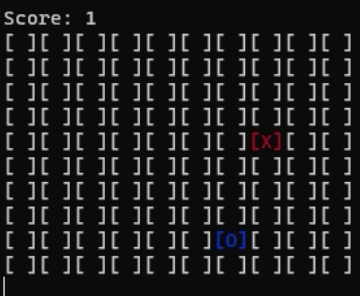

# NEAT-PySnake
Work in progress....

Goal: Training a NN to play the Snake game

Currently only the base game is implemented. It can be played (kinda!) in the console.

## Current demo

# Todo
- ✅ Fix intial bugs
- Add variables to the snake class for training the AI
- convert the UI from console to pyGame
- Implement the ability to run multiple instances at the same time
